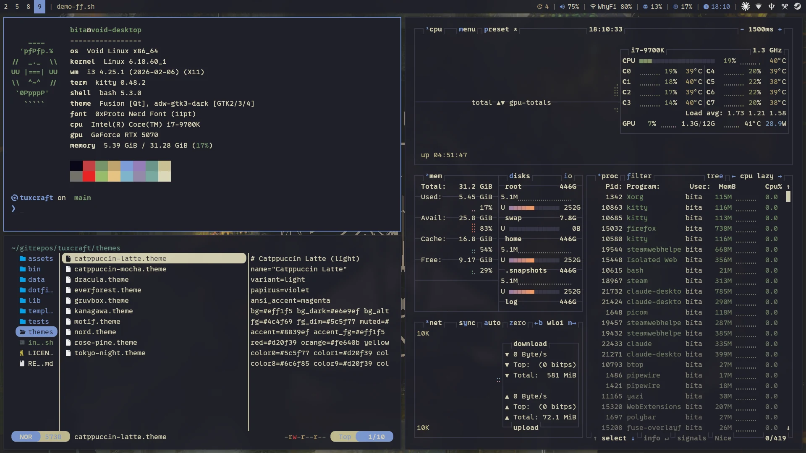
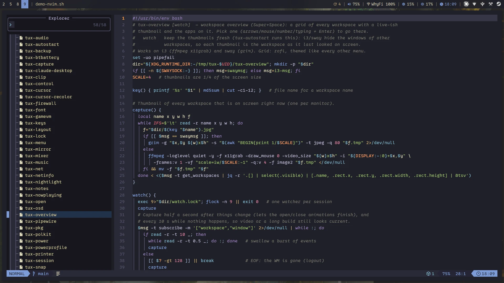
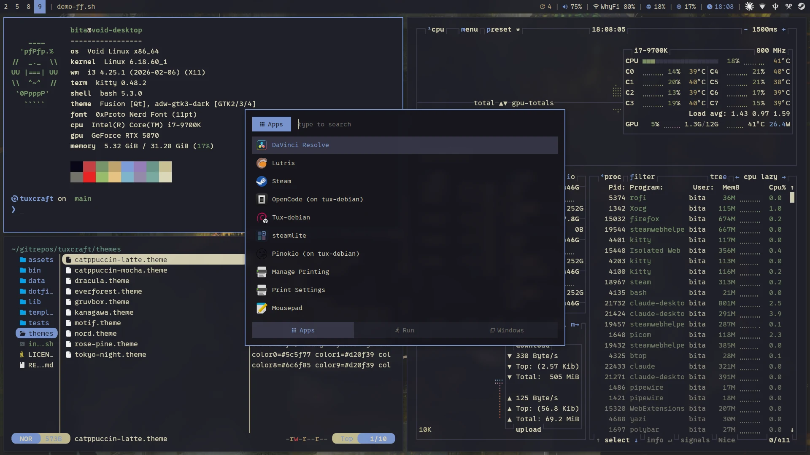
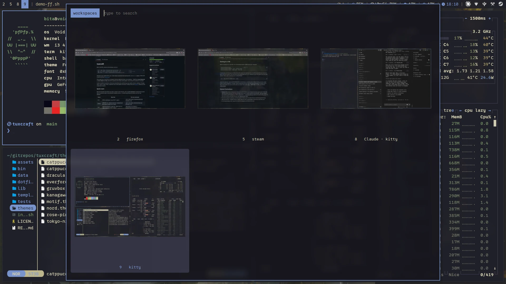
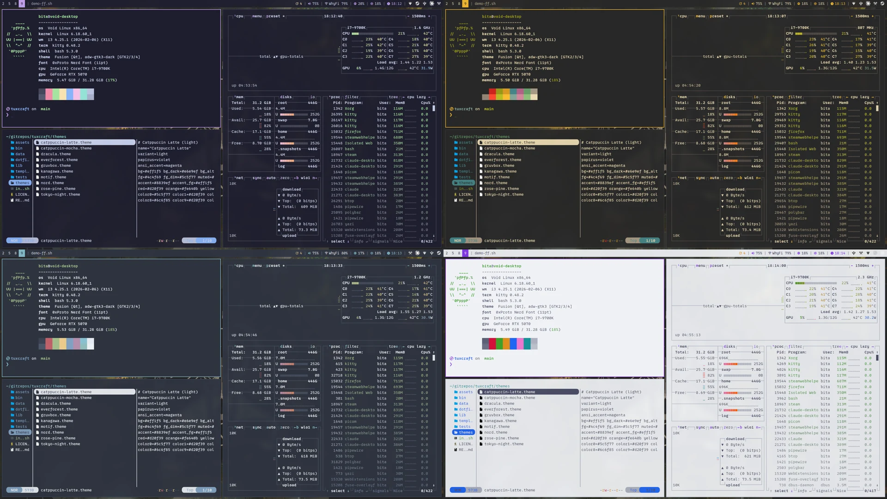
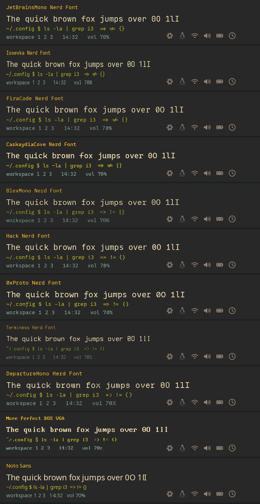

# tuxcraft

**Easiest:** download `tuxcraft-*.iso` from the [latest release](https://github.com/plaintextlab/tuxcraft/releases/latest),
write it to a USB stick, boot it. The installer starts by itself and asks which Linux you want:
**Arch, Debian or Void**. See [The tuxcraft ISO](#the-tuxcraft-iso).

**Or** boot any of the three distros' own live ISOs, connect to the internet, and run:

```sh
curl -fsSL https://plaintextlab.org/tuxcraft | sh                 # Arch
wget -nv -O- https://plaintextlab.org/tuxcraft | sh              # Debian live
xbps-fetch -o t https://plaintextlab.org/tuxcraft && sh t         # Void
```

Already set up? Update with `tux-update` (or `curl -fsSL https://plaintextlab.org/tuxcraft | sh -s -- --update`).
Which ISO to boot and more: [Quick start](#quick-start).



One script from a live ISO to a complete, themed, keyboard-driven Linux desktop —
**i3 (X11) or sway (Wayland)** on **Arch, Debian or Void**, with btrfs snapshots that
make a bad update a two-minute fix instead of a reinstall.

It asks a handful of questions, then does everything else: partitioning, base system,
drivers, desktop, TUI apps, fonts, colours, login screen, snapshots and a safe update command.
Configs come from [debi3n](https://github.com/plaintextlab/debi3n), cleaned up and made
distro-neutral.

## Screenshots

| Neovim (LazyVim, VS Code keys) | App launcher (Super+D) |
|---|---|
|  |  |
| **Workspace overview (Super+Space)** | **One palette, every app: `tux-theme set <name>`** |
|  |  |

The theme grid shows Catppuccin Mocha, Gruvbox, Nord and Catppuccin Latte. The bar, borders,
terminal, file manager, btop, menus and mouse cursor all switch together. Ten themes ship
with tuxcraft (see `themes/`).

## The tuxcraft ISO

One USB stick installs any of the three. It is Arch's official install ISO (same kernel,
firmware and boot loaders) with tuxcraft added and started on the first console.

1. Download `tuxcraft-<version>-x86_64.iso` and check it: `sha256sum -c tuxcraft-*.iso.sha256`.
2. Write it: `sudo dd if=tuxcraft-*.iso of=/dev/sdX bs=4M status=progress oflag=sync` (or Ventoy, Rufus in DD mode).
3. **Turn Secure Boot off** in the firmware settings. The ISO is not signed with Microsoft's key.
4. Boot it. With a network cable it is online at once; otherwise it lists Wi-Fi networks to pick from.
5. Answer the questions: **Arch / Debian / Void**, where to install, encryption, user, desktop.
   Everything else is automatic, then it reboots into your new desktop.

Other consoles (Alt+F2 … F6) are root shells if you want to look around. How the three get
installed from one Arch-based ISO: Arch with `pacstrap`, Debian with `debootstrap` (checked
against Debian's archive key), Void with Void's static `xbps` (checked against Void's signing
keys). After that first step everything runs inside the new system with its own package manager,
exactly as when you start from that distro's own ISO.

**No questions at all:** put an `answers.conf` (see [What it asks](#what-it-asks); the keys are
listed in `./install.sh --help`) on a USB stick or partition labelled `TUXCFG`, optionally with a
`post-hook.sh` that runs as root in the new system at the end. Boot the ISO with it plugged in and
the install runs unattended.

Build it yourself on Arch: `sudo pacman -S archiso && sudo iso/build.sh`.

## Quick start (the distro's own live ISO)

The script keeps working on its own, for when you already booted a live ISO by hand.

Boot the live ISO of the distro you want, connect to the internet, and run **one command**.
It downloads tuxcraft, asks its questions (disk, user, password, desktop, extras…), installs
everything and reboots into the new desktop.

| Distro | Boot this | The one command |
|---|---|---|
| Arch | official `archlinux-*.iso` | `curl -fsSL https://plaintextlab.org/tuxcraft \| sh` |
| Debian | a **live** ISO, e.g. `debian-live-13-*-standard.iso` (the netinst image has no shell) | `wget -nv -O- https://plaintextlab.org/tuxcraft \| sh` |
| Void | `void-live-x86_64-*-base.iso`, glibc (log in as `root`/`voidlinux`) | `xbps-fetch -o t https://plaintextlab.org/tuxcraft && sh t` |

### Connecting to the internet

A network cable just works on Arch and Void. On Debian, run `sudo dhcpcd` once. For Wi-Fi,
first find your Wi-Fi interface: `ip link` lists it, its name starts with `wl` (e.g. `wlan0`,
`wlp2s0`). Replace `wlan0` below with yours, and `MyNetwork` / `MyPassword` with your own
(keep the single quotes).

**Arch** (iwd):

```sh
iwctl station wlan0 scan && iwctl station wlan0 get-networks   # optional: list networks
iwctl --passphrase 'MyPassword' station wlan0 connect 'MyNetwork'
```

**Debian live** (the standard ISO has no NetworkManager, so no nmtui):

```sh
wpa_passphrase 'MyNetwork' 'MyPassword' | sudo tee -a /etc/wpa_supplicant/wpa_supplicant.conf >/dev/null
sudo wpa_supplicant -B -i wlan0 -c /etc/wpa_supplicant/wpa_supplicant.conf && sudo dhcpcd wlan0
```

**Void** (the base ISO has no NetworkManager either; wpa_supplicant and dhcpcd already run,
and you are root):

```sh
wpa_passphrase 'MyNetwork' 'MyPassword' >> /etc/wpa_supplicant/wpa_supplicant.conf
sv restart wpa_supplicant
```

Then check with `ping -c2 github.com`. If that fails:

- **No `wl…` interface:** the card was not recognised. A cable or USB tethering from your
  phone is the quick way around it (Debian: `sudo dhcpcd`).
- **"RF-kill" / blocked:** Wi-Fi is switched off by a hardware switch or Fn key. Turn it on
  (Arch also has `rfkill unblock wifi`).
- **Still no address:** usually a mistyped name or password. Run `wpa_supplicant` without
  `-B` (Debian/Void) to see why it is refused, or check `iwctl station wlan0 show` (Arch).
- **Desktop live ISO** (GNOME, KDE, Xfce…): it has NetworkManager. Use the panel's Wi-Fi menu
  or `nmtui`.

The Wi-Fi you join here is copied into the new system, so it is online on first boot.

While it installs, every command is shown as it runs (`$ apt-get install …`), with its output
dimmed below it; everything also goes to `/var/log/tuxcraft.log`. If something fails, the
failed command and its error are the last thing on the screen. For a calmer screen that shows
only the steps, run it with `TUX_QUIET=1`, e.g. `wget -nv -O- https://plaintextlab.org/tuxcraft | TUX_QUIET=1 sh`.

Each uses the download tool that ISO already has (curl, wget, xbps-fetch) and needs no git:
the repository comes as a tarball. `| sh` and `| bash` both work. The script becomes
root with sudo when needed and installs curl itself where it is missing. On a system that is
already installed, the same command sets up only the desktop.

`plaintextlab.org/tuxcraft` is a small launcher that fetches the current `install.sh` from this
repository and runs it. The same works straight from GitHub:
`curl -fsSL https://raw.githubusercontent.com/plaintextlab/tuxcraft/main/install.sh | sh`. Pass options after `sh -s --`, e.g.
`curl -fsSL https://plaintextlab.org/tuxcraft | sh -s -- --update`.

On Void, the installer times the mirrors from the official list and uses the fastest
up-to-date one for every repository (no xmirror needed). Re-pick any time with `sudo tux-mirror`
(`--list` shows the timings, `sudo tux-mirror https://…` sets one).

Already have a minimal install (e.g. Debian from the normal installer)? Run the same
command there: tuxcraft detects that it is not on a live ISO and only sets up the desktop
(snapshots are added too if `/` is btrfs).

## What it asks

1. **Which distro** (live ISO only): the tuxcraft ISO offers Arch, Debian and Void; a Debian or
   Void live ISO offers its own distro and the other of those two (Arch needs an Arch host)
2. **Where:** erase a whole disk, use **free space** next to Windows or another system, or replace
   **one partition** (dual boot, UEFI only: the existing EFI partition is shared, never formatted,
   and os-prober adds the other system to the GRUB menu)
3. **Encryption** (default on): LUKS2 over the whole btrfs root including `/boot`. GRUB asks for the
   passphrase once at power-on (US keyboard layout at that prompt); a key file inside the
   encrypted disk spares you a second prompt. Snapshots and rollback work the same.
4. Computer name, user, password, timezone, keyboard. The timezone is **not** looked up online
   unless you say yes (that sends your IP address to ipapi.co).
5. **Desktop**: **i3 and dwm** (default; the login screen starts i3 until you pick dwm), **X11 + i3**, **Wayland + sway**, **X11 + Xfce**, or **i3 and Xfce** — same theme and fonts in every one ([Xfce](#xfce-next-to-or-instead-of-i3), [dwm](#dwm-next-to-i3))
6. **NVIDIA proprietary driver?** (only asked when an NVIDIA GPU is detected; Intel/AMD just work)
7. **Colour scheme** — Gruvbox, Everforest, Catppuccin Mocha/Latte, Nord, Tokyo Night, Rosé Pine, Kanagawa, Dracula, Motif
8. **Font** (previews below) and size
9. **Browser** and **optional extras** (firewall, Flatpak, wallpapers, Bluetooth, music, printing, dev tools, office, gaming, paru).
   *Music* (on by default) = **rmpc** + mpd with album art and a **cava** visualizer: **Super+M** opens it
   (`8` = full-screen visualizer), **Super+Shift+M** opens cava on its own. Pick the music folder with
   **System menu → Sound → Music folder** or `tux-music folder ~/path` — no mpd.conf editing.
   *Gaming* = Steam, gamemode, MangoHud, Heroic (Flatpak), plus the limits Proton needs (`vm.max_map_count`,
   open files); on Void also gamescope, Wine, winetricks, protontricks, vkBasalt and the 32-bit libraries.
   With the NVIDIA driver, the matching Flatpak GL runtime is installed so Flatpak games use the GPU,
   and `/dev/nvidia-uvm` is created at boot so CUDA/NVENC work, also in Flatpak apps (OBS GPU encoding).
   *Printing* and *Office* (LibreOffice) are on by default. Printing sets up CUPS with network
   (mDNS) and USB (ipp-usb) discovery and driverless IPP printing; printers found at install time
   get their vendor driver (hplip, escpr, brlaser, splix). At the first login, printers on the
   network are added automatically; later, **System menu → Network & devices → Printers** or `tux-printer`.
10. Extra packages to **add**, packages to **leave out**

Answers are saved to `/etc/tuxcraft/answers.conf` (without either password); reuse them for an
identical machine with `sudo ./install.sh --config answers.conf --yes`.

## Fonts



Every choice gets Nerd Font icons through a fallback, so the bar and launcher look right even
with the DOS font. Change any time with **Super+Ctrl+F** or `tux-font set dos 13`; the size is the
first entry of that menu (or `tux-font size 13`). The login screen follows both: the font is
rendered as a console font (`tux-psf`) and scaled to the screen, so tuigreet uses the same letters.
So do the boot messages (the init system loads that font first thing; only the kernel's own first
lines keep its built-in font) and the GRUB menu, which gets the same font as a GRUB font
(`tux-psf --pf2`) and the theme's colours (`/boot/grub/themes/tuxcraft`, switched with `tux-theme`).

## What you get

| Area | X11 session | Wayland session |
|---|---|---|
| Window manager | i3 | sway |
| Bar | polybar | waybar |
| Launcher / menus | rofi | fuzzel |
| Compositor | picom: Hyprland-style animations (springy open, gliding tiles, workspace crossfade) at the monitor's refresh rate, blurred background behind terminals and menus | built in (no blur: sway cannot) |
| Lock / idle | i3lock + xss-lock (xtrlock: see-through) | swaylock + swayidle |
| Wallpaper | feh | swaybg |
| Clipboard history | tux-clip: BreadOnPenguins' text + image history (dmenu/rofi, fzf previews) | cliphist |
| Screenshots / recording | maim, ffmpeg | grim, slurp, wf-recorder |
| Monitors | autorandr / arandr | kanshi |

Shared by both: **kitty** (via `tux-term`), dunst, PipeWire, NetworkManager, polkit agent, gnome-keyring,
udiskie, gammastep (night light), xdg portals, Papirus icons, adw-gtk3, Thunar and Mousepad, **Lutris**
and **ProtonPlus** (Flathub: installs Proton-GE / Wine-GE for Steam, Lutris and Heroic). Brightness
keys use **brightnessctl** when the screen has a backlight (laptops) and **ddcutil** when it has none
(desktops: the monitor itself is set over DDC/CI; tuxcraft loads `i2c-dev` and adds you to the `i2c`
group so it can reach it).

**Copying to USB sticks shows the real progress:** USB disks and SD cards may hold at most 16 MiB
of unwritten data in RAM, so a copy no longer jumps to 100% and then hangs while the data is
still being written (or the unmount does). Internal disks start writing at 64 MiB and cap at
256 MiB, so a big copy never stalls the desktop while gigabytes are flushed at once.

**Stays responsive under load:** zram swap (zstd, half the RAM, at most 8 GiB) with the kernel
tuned for it, and **earlyoom**, which ends the biggest process when memory runs out instead of
letting the desktop freeze. Key repeat starts after 220 ms at 40 per second, and window
animations last 100–160 ms.

**Login screen:** greetd + **tuigreet** — a TUI login that fits a keyboard-driven setup, works with
X11 and Wayland, systemd and runit, and is coloured by the system theme (the console palette is
themed too) and drawn in the desktop font at a matching size. LightDM is used only if tuigreet is
not packaged.

**Terminal and images:** kitty is the default because it shows real images (kitty graphics
protocol, X11 and Wayland): album art in rmpc, image previews in yazi, and `img photo.jpg` for any
picture (chafa; block art over ssh/tmux). Everything opens the terminal through `tux-term`; for
Alacritty instead, put `TERMINAL=alacritty` in `~/.config/tuxcraft/state` (no images there).
kitty runs as one process for all windows, so a new terminal opens instantly, and its cursor
leaves a short trail when it jumps.

**Shell:** bash with **ble.sh**: grey command hints from history as you type (→ or End accepts,
Alt+F takes one word), syntax colours and a completion menu (off: `touch ~/.config/tuxcraft/no-blesh`).
History keeps 200,000 commands with no duplicates and none of the noise (`clear`, `ls`, `cd`, ...),
is saved after every command, and is searched with **Ctrl+R** (fzf) or by typing the start of a
command and pressing **Up/Down**.

**Neovim = LazyVim, set up like VS Code** (`nvim`): file tree, tabs, fuzzy finder, LSP, completion,
format on save and git signs, ready on first start (the installer pre-installs the plugins).
Python, TypeScript/JavaScript, JSON, YAML, TOML, Markdown, Docker and git files are set up;
their language servers install on first use (`:Mason`), more languages via `:LazyExtras`.
Colours follow the tuxcraft scheme (its real Neovim theme, or your palette via mini.base16).

| VS Code key | Does |
|---|---|
| Ctrl+P / F1 | find file / command palette |
| Ctrl+Shift+F | search in all files |
| Ctrl+B | file explorer |
| Ctrl+/ | toggle comment |
| Ctrl+S | save |
| F2 / F12 / Ctrl+. | rename / go to definition / quick fix |
| Shift+Alt+F | format |
| Alt+↑ / Alt+↓ | move line |
| Ctrl+Tab | next tab |
| Ctrl+\` | terminal |

Everything else: press **Space** and wait, a menu of every command appears.

**Mouse cursor:** coloured like the scheme (Catppuccin cursors in the shade closest to the accent,
picked and downloaded by `tux-theme`); `CURSOR=Adwaita` in the state file keeps the plain one.

**Fast app start (`tux-warm`):** the browser, the terminal and the file manager open faster. Every
10 minutes their programs, libraries and app folders, plus what every desktop app loads (the
graphics driver, font and icon caches), are read into the page cache at idle disk priority. The
terminal's and Thunar's light server modes also stay running (`alacritty --daemon`, a hidden kitty
instance, `thunar --daemon`), so a new window appears at once. Time to the first window, cold vs. warm
(SATA SSD, software-rendered X, so GPU apps are slower than usual):

| App | cold | warmed | from its server mode |
|---|---|---|---|
| Alacritty | ~540 ms | ~190 ms | ~85 ms |
| Thunar | ~810 ms | ~520 ms | ~90 ms |
| Firefox | ~1.7 s | ~1.25 s | – |
| kitty | – | ~770 ms | ~60 ms |

It never makes memory tight. Warmed files are ordinary page cache, which the kernel hands to any
program that needs RAM. Nothing is locked (no `mlock`, no RAM disk), and the total is capped at 10%
of RAM. Server modes run only with 8 GB of RAM or more. Warming pauses, and idle server modes stop,
while MemAvailable is under 25% of RAM (or 2 GB), memory pressure is above 0.5%, or a big program or
game runs (Steam, gamescope, the gaming VM, DaVinci Resolve, Blender, Wine/Proton, OBS, Kdenlive).
They come back 2 minutes after that ends. A server mode holding one of your windows is never closed
under you. Which apps, the limits and the big-program list: `~/.config/tuxcraft/warm.conf`
(`tux-warm --edit`; written on first start, never overwritten). `tux-warm status` shows what is
warm and how much of it is in RAM.

**Off switch:** system menu (Super+Escape) → Settings → *Fast app start: switch off*, or `tux-warm off`.
It stays off after the next login; `tux-warm on` turns it back on. Idle server modes close at once;
one that still holds a terminal or Thunar window closes with that window.

**Files:** Thunar, yazi in the terminal. Thunar's right-click menu adds:
- **Open Terminal Here**.
- **Move the latest file here** (empty area of a folder): moves your newest download, screenshot or
  recording into that folder. Hidden files, partial downloads, files still being written and the
  wallpaper pack are skipped; an existing file is never overwritten (the moved one becomes `name (2).ext`).
- **Remove audio** (video files): saves a copy without sound as `name (no audio).ext`, losslessly
  (`ffmpeg -c copy`, video and subtitles kept). The original is left alone.
- **Drive space**: a used/free bar for every mounted drive, like Explorer's "This PC"; pick one to open
  it. Thunar itself cannot draw bars in its side pane. It shows the free space of the current drive in
  the status bar (nothing selected), a usage bar in Properties (right-click a drive), and used/free in
  the side-pane tooltip.
- **Set as wallpaper** (one image).

**TUI apps:** yazi (files), btop, lazygit, wifitui (Wi-Fi; nmtui for wired/VPN), bluetui, wiremix/pulsemixer, ncdu, micro + neovim,
fzf, bat, eza, fd, ripgrep, zoxide, starship, fastfetch, calcurse, qalc, tealdeer, tmux, rmpc, cava.

## One theme, everywhere

`tux-theme` renders a single palette into i3/sway, polybar/waybar, rofi/fuzzel, dunst, kitty, Alacritty, rmpc, cava,
GTK 3 (adw-gtk3), GTK 4/libadwaita, **Qt 5/6 (qt5ct/qt6ct, Fusion + the same palette, so Qt and
GTK apps match)**, btop, micro, starship, fzf, zathura, swaylock, the wallpaper, the login screen
and the TTY. Switch with **Super+Ctrl+T** or `tux-theme set nord`.

**Wallpapers per theme:** `~/Pictures/Wallpapers/<theme>/` (gruvbox, nord, …) holds four photos
for each theme, from Wikimedia Commons and colour-graded toward its palette (authors and licences:
[`assets/wallpapers/CREDITS.md`](assets/wallpapers/CREDITS.md)). Switching theme puts up one of
its wallpapers; **Super+Shift+W** changes to another from the same theme. Drop your own images in
a theme's folder and they join its rotation; a theme with an empty folder gets a gradient in its
colours. The installer copies the wallpapers on a new machine; one you delete stays deleted.

**Wallpaper picker (Super+Ctrl+W):** BreadOnPenguins' thumbnail grid (nsxiv): arrows move, `m`
marks one, `q` uses it, Enter shows one big. `tux-wallpaper --list` is the text menu (with the
theme gradient and random).

**Colours from the wallpaper (like pywal):** picking a wallpaper with **Super+Ctrl+W**, or
Thunar's right-click **Set as wallpaper**, also makes a palette from that image (`tux-wal`) and
switches to it: the theme `wal`. Its background is the image's darkest common colour, made very
dark; its accent is the image's most colourful common colour. Warning red, OK green and the other
named colours keep their meaning, in the wallpaper's own shade where it has one. Super+Shift+W
then picks any wallpaper, with its colours. The fixed themes are all still there: pick one with
**Super+Ctrl+T** to go back (and `wal` in that menu to return to wallpaper colours).
`tux-wallpaper set FILE --keep-colours` changes only the image. The login screen, TTY and GRUB
boot menu take the wallpaper colours too, like any other theme.

**Firefox** follows too (`tux-firefox`, run by every theme or font change): tabs, toolbar,
address bar, menus and the new-tab page take the palette, with square corners on menus,
panels, buttons and tabs; it switches to dark or light with the theme; and every website shows
its text in your UI font and code in your terminal font (icon fonts still load). Firefox reads
this when it starts, so restart it after a change; the theme notification reminds you. It
covers every profile of Firefox, Flatpak Firefox and LibreWolf, and keeps your own
`userChrome.css` and `user.js` (tuxcraft adds one `@import` line and a marked block).
Settings in `~/.config/tuxcraft/state`: `FIREFOX_CORNERS=round` keeps Firefox's rounded
corners, `FIREFOX_FONTS=site` lets websites use their own fonts again, `FIREFOX_THEME=no`
leaves Firefox alone.

Own palette: copy any file from `/usr/share/tuxcraft/themes/` to `~/.config/tuxcraft/themes/`,
edit the colours, `tux-theme set <name>`.

## Not breaking the system

| Layer | What happens |
|---|---|
| btrfs layout | `@`, `@home`, `@snapshots`, `@var_log`, `@var_cache`, `@var_tmp`; zstd compression |
| Automatic snapshots | snapper timeline of `/` and `/home`: hourly, daily, weekly, monthly (8/7/4/3 for `/`), plus one per boot; pruned automatically |
| Package snapshots | before/after every pacman (snap-pac) / apt (hook) / `sysup` (Void) transaction |
| Boot a snapshot | GRUB → *tuxcraft snapshots* (grub-btrfs) |
| Roll back | `tux-snap rollback <n>` → reboot. `/home` is never touched |
| Updates | `sysup` (Super+U): battery/space checks, **Arch news gate**, update, flatpaks, cache cleanup, `.pacnew` report, reboot hint |
| Fallback kernel | Arch installs `linux` **and** `linux-lts` |
| Debian | security updates install themselves; everything else waits for `sysup` |
| Off-disk backups | `tux-backup` → incremental `btrfs send` to an external btrfs drive (rsync for other filesystems) |
| Shutdown guard | logout / reboot / shutdown from the power menu first lists what would be lost (DaVinci Resolve, OBS recording, unsaved windows, file copies, package updates, VMs, downloads …) and asks; Cancel is the default. Edit the list: system menu → Settings → *Shutdown guard list*, or `~/.config/tuxcraft/power-guard.conf` |
| `rm` | aliased to `trash-put` in the shell (`rmf` for the real thing) |

Snapshots live on the same disk. They protect against bad updates and mistakes, **not** against a
dead SSD — that is what `tux-backup` is for.

### Recovering from a bad update
1. Reboot, pick **tuxcraft snapshots** in GRUB, choose a snapshot from before the update.
2. Log in (the snapshot is read-only, that's fine), run `tux-snap` to see the list, then
   `tux-snap rollback <n>` and reboot.
3. Later: `tux-snap clean` removes the broken root that was set aside.

## Xfce, next to or instead of i3

The installer's **Desktop** question offers i3 and dwm (default), i3, sway, **Xfce**, or **i3 and Xfce**;
only what you pick is installed. To add Xfce to an i3 system later: `tux-xfce install`. Then log
out, press **F3** on the login screen and pick **tuxcraft (Xfce)** (the stock "Xfce Session"
entry works too, but without tuxcraft's environment).

- **Same look:** Xfce gets the values tux-theme gives i3 (GTK theme, icons, cursor, UI and
  monospace font, antialiasing), the same wallpaper, kitty, dunst, Qt and Firefox theming.
  Changing the theme, font or wallpaper in either session changes both. Window borders use
  xfwm4's Default theme, which takes its colours from the GTK theme.
- **Only Xfce's core** is installed (session, xfwm4, panel, desktop, settings, task
  manager, pavucontrol, blueman). Thunar, kitty, dunst, tux-lock and tux-battery serve both
  sessions, so nothing runs twice.
- **With both installed, each lists its own utilities:** i3 shows the TUI ones (yazi, btop,
  nvim…), Xfce the GUI ones (task manager, pavucontrol, blueman, network editor…). Everything
  else shows in both, Thunar and Mousepad included, and opens the same files the same way. The
  list: `data/session-apps.tsv`; your own additions in `~/.config/tuxcraft/session-apps.tsv`.
  Only launchers are hidden: every app still runs, and i3's keys are unchanged.
- **Removing it:** from i3 (not from inside Xfce), run `tux-xfce remove`. It removes the Xfce
  packages, its login entry and the split launchers, and moves `~/.config/xfce4` to
  `~/.local/state/tuxcraft/xfce-backup-<date>/`. i3 is not touched. When Xfce is the only
  desktop, re-run the installer with "i3 and Xfce" first.

## dwm, next to i3

**i3 and dwm** in the installer's Desktop question (the default), or `tux-dwm install` on an i3 system later,
adds a dwm session: **F3** on the login screen → **tuxcraft (dwm)**; the login screen remembers each user's last pick. It is
[BreadOnPenguins' dwm build](https://github.com/BreadOnPenguins/dwm) and her look (20 px gaps,
1 px borders, a flat bar with the tag numbers, empty tags hidden, her dmenu centred, picom with
square corners, blur and see-through unfocused windows), with **the same keys as i3**.

- **Built from source**, as dwm always is: `src/dwm` and `src/dmenu` are her builds (MIT, like
  dwm), `src/dwmblocks` is torrinfail's dwmblocks (ISC), with tuxcraft's changes marked `tuxcraft` in the code. They are compiled into
  `/usr/local/bin` at install, and again by `tux-update` when the sources change.
- **Same keys:** dwm's `config.h` was written from `~/.config/tuxcraft/wm/common.conf` and the i3
  config, so Super+K lists them for both. Where dwm has no i3 equivalent, tuxcraft's dwm
  changes add one: pressing Super+N again goes back to the last tag, Super+Tab goes to the
  next tag that has windows, Super+R is a resize mode, Super+-/Super+Shift+- is a scratchpad,
  and Super+Alt+Space floats every window. dwm tiles in a master/stack layout instead of i3's
  manual splits. Super+Shift+H / V pick side-by-side or top/bottom, Super+S / W / X give the
  deck, one-at-a-time and toggle-split layouts. Super+Space lists the tags and their windows
  instead of showing thumbnails.
- **Same theme:** `tux-theme` and `tux-font` write dwm's and dmenu's colours and font into
  `~/.Xresources` and restart dwm in place. Windows keep their tags.
- **Bar:** dwm's own bar on the left; on the right **dwmblocks**, as in her setup
  ([torrinfail's](https://github.com/torrinfail/dwmblocks), with click support, `src/dwmblocks`).
  Its blocks are `tux-dwmbar` (music with previous / play-pause / next buttons, CPU, memory, GPU, updates, Bluetooth, volume, network,
  battery, power profile, recording, clock), with polybar's clicks.
- **picom:** dwm uses `~/.config/picom/dwm.conf`; i3 keeps `picom.conf`. The tuxcraft picom
  config from before dwm was added is kept in `~/.config/picom/backup/picom.conf`.
- **Your own config:** copy `/usr/share/tuxcraft/src/dwm/config.def.h` to
  `~/.config/tuxcraft/dwm/config.h`, edit it, then run `tux-dwm build`. Updates keep using
  yours.
- **Not in dwm:** no system tray (udiskie runs without its icon), no workspace
  thumbnails, and no "recent programs" list (it follows i3's window events).
- **Removing it:** `tux-dwm remove` (from i3 or a TTY). i3 is not touched.

## Keys (Super = Windows key)

`Super+K` shows the complete list. The essentials:

| Keys | Action | Keys | Action |
|---|---|---|---|
| Super+Enter | terminal | Super+D | launcher |
| Super+Space / top-left corner | **workspace overview** (thumbnails, pick one) | Super+Q | close |
| Super+E / Shift+E | Thunar / Thunar in /media | Super+B | browser |
| Super+Escape | **system menu** | Super+U | **update (sysup)** |
| Super+V | clipboard history | Print / Super+Print | screenshot / capture menu (Super+Shift+Print: start / stop recording) |
| Super+Ctrl+T / F / W | theme / font / wallpaper | Super+Ctrl+N / B / A / M | network / bluetooth / audio / btop |
| Super+Shift+L | power menu | Super+L | lock |
| Super+Alt+L | lock keys only: screen stays visible (xtrlock, i3; sway uses the normal lock) | Super+. | emoji picker (types it, and copies it) |
| Super+1..0 | workspaces | Super+Shift+1..0 | move window |
| Super+O | window switcher | Super+Tab / Shift+Tab | next / previous workspace |
| Super+F | fullscreen | Super+Shift+Space | float / tile |
| Super+T | notes | Super+A | web apps |
| Super+Z | **recent files** (films, music, documents, pictures …; pick one to reopen it) | Super+Shift+Z | **recent programs** (pick one to start it again) |
| Super+G | **drag shelf**: park files, text, links and images, drag them out later (X11: shake the mouse while dragging to open it) | | |
| Super+Alt+Tab / +Shift | next / previous window in this workspace | Alt+Tab (hold Alt) | **workspace switcher**, most recent first (tap: last workspace) |
| Super+F1 … F11 | brightness (+ monitor contrast) 0% … 100% | Super+Alt+Up / Down | brightness; below 0% dims to −80% |
| Super + drag a window to the right / left screen edge | move it to the next / previous workspace and go there | Bar: tile / float icon | this workspace: float every window, click again: tile them all |
| Touchpad: 4 fingers left / right | next / previous workspace (the workspace follows your fingers, as on GNOME and macOS; in dwm it slides along live while you drag, and goes back if you let go before a third) | Touchpad: 4 fingers up | workspace overview |
| Super + drag a tiled window (dwm) | move it to another place in the tiling: it takes the place of the window under the pointer, nothing floats | Super+Shift + drag (dwm) | float the window and move it freely |
| Super + two-finger drag (touchpad, dwm) | resize, as Super + right drag: the split follows the fingers, a floating window grows from its corner | | |

## Commands

| Command | Does |
|---|---|
| `sysup` | the one safe way to update |
| `tux-update` | update tuxcraft itself (tools, configs, fixes) with your saved choices; same as the `--update` one-liner. Also in the System menu → Updates & backups → Update tuxcraft |
| `tux-snap` | list / create / diff / restore a file / rollback / clean |
| `tux-backup [mountpoint]` | backup to an external drive |
| `tux-watch CMD` | start a big program (`tux-watch steam`) with everything it prints shown live in a terminal window: errors in red, warnings in yellow, and how it ended (exit code or crash signal). The program runs on its own, so close the window any time and it keeps running. Saved under `~/.local/state/tuxcraft/watch` (last 20); `tux-watch --last` shows the newest again, `--here` watches in the current terminal |
| `tux-display [mirror\|extend\|tv\|laptop\|audio\|status]` | external screens on i3: a TV or monitor plugged in is mirrored by itself (started at login; `EXTERNAL_DISPLAY=extend` or `tv` in `~/.config/tuxcraft/state` picks another default), unplugging goes back to the laptop panel. If the TV lacks the laptop's resolution, the picture is scaled to fill it. Sound follows: the TV's HDMI sound becomes the output (playing streams move along) and the previous output comes back when it is unplugged; `EXTERNAL_AUDIO=off` leaves sound alone, `tux-display audio [on\|off]` switches now. Watches X's RandR events (`xev`), or asks X every 2 s without it |
| `tux-recent files\|apps` | menus behind Super+Z / Super+Shift+Z. Files come from the list GTK apps keep (`~/.local/share/recently-used.xbel`: Thunar, LibreOffice, Mousepad, file dialogs, browser downloads) plus what mpv plays; programs are recorded by `tux-recent watch` (started at login) whenever a window opens, for every app with a launcher |
| `tux-autologin [on\|off\|status]` | log in by itself at boot behind the lock screen, so the desktop and its autostart apps load while you type your password (System menu → Settings → Auto login). Uses greetd's one-time `[initial_session]`; after a logout the normal login screen is back. If the lock does not appear the session ends. The keyring asks for your password once, the first time an app needs it. Refuses on an unencrypted disk unless you add `--anyway` (the menu asks) |
| `tux-drives [list\|on\|off NAME\|space]` | `space`: used/free bar per drive. Otherwise: choose which drives mount by themselves (System menu → Network & devices → Drives): internal ones go in `/etc/fstab` with `nofail` and mount at boot under `/media/<label>`; external ones are mounted by udiskie when plugged in, unless you switch them off |
| `tux-theme`, `tux-font`, `tux-wallpaper` | look & feel |
| `tux-xfce install` / `remove` | add Xfce next to i3 later, or take it out again ([Xfce](#xfce-next-to-or-instead-of-i3)) |
| `tux-dwm install` / `build` / `remove` | add the dwm session, rebuild it after editing its config, or take it out ([dwm](#dwm-next-to-i3)) |
| `tux-gitsetup` | sign in to GitHub once (browser + one-time code, also in the System menu): every repo then clones, pulls and pushes without a password; also sets your commit name and email (offers GitHub's private no-reply address). `status`, `logout` |
| `tux-pkg install/remove/search/list` | one package command everywhere (`ii`, `rr`, `ss` aliases): host repo first, then Flathub, vendor repos (`data/vendor-repos.tsv`), Arch/Debian/Fedora repos and the AUR in distrobox "boxes"; `sysup` updates the boxes |
| `tux-firewall [status\|on\|off\|allow\|deny]` | nftables firewall: incoming connections blocked except the ports you open to the LAN (`tux-firewall allow 8188/tcp`); SSH is open by default. Never touches libvirt/docker rules |
| `tux-gamevm` | Windows gaming VM with GPU passthrough, single-GPU (desktop) or hybrid (laptop); see below. Appears in System menu → Virtual machines once created |
| `tux-ubuntuvm` | a throwaway Ubuntu VM for experiments: reset to a fresh install in seconds, snapshots, delete; see below. System menu → Virtual machines |
| `tux-guard --list` / `--edit` | what would block a shutdown right now / edit the watch list |
| `tux-warm status` / `off` / `on` / `--edit` | fast app start: what is kept warm, switch it off/on, choose the apps |
| `tux-winslot [--debug]` | keeps DaVinci Resolve in its workspace and tiling slot when the Cinema Viewer (Ctrl+F) hides and re-shows its window; restarts itself after `tux-update`. Log: `~/.local/state/tuxcraft/winslot.log`. For a big preview that never touches i3: Super+F (i3 fullscreen) plus Resolve's Enhanced Viewer (*Workspace ▸ Viewer Mode*) |
| `tux-gestures status` / `restart` | 4-finger touchpad swipes on i3 and dwm (started at login when there is a touchpad): left / right = next / previous workspace, up = overview. Reads `libinput debug-events` (input group) and presses Super+Tab / Super+Shift+Tab / Super+Space, so 2- and 3-finger gestures are untouched. dwm does left / right itself when it was built with libinput's headers (`tux-dwm build`; the dwm packages bring them): the workspaces then follow the fingers live. `GESTURES=off`, `GESTURE_FINGERS=3` or `GESTURE_MIN=` (distance, default 150) in `~/.config/tuxcraft/state`; dwm's own finger count is `SWIPEFINGERS` in its `config.h` |
| `tux-hotcorner` | hot corner like GNOME's on i3 and dwm (started at login): rest the mouse in the top-left corner for half a second and the workspace overview opens (the Super+Space grid); rest it there again to close it. Once per visit, not while a mouse button is held or a fullscreen window has focus. `HOT_CORNER=0` in `~/.config/tuxcraft/state` turns it off |
| `tux-dwt status` / `restart` | touchpad off while typing (i3), back 600 ms after the last key; `DWT_MS=` in `~/.config/tuxcraft/state` changes the delay, `0` turns it off |
| `tux-awake status` / `restart` | no screen lock or blanking while something plays (a video in the browser, mpv, VLC, music), on battery too: a media player says it is playing (MPRIS) or a program sends sound that is not paused. Started at login; a screen you lock yourself still goes dark. `AWAKE_MEDIA=off` in `~/.config/tuxcraft/state` turns it off. Log: `~/.local/state/tuxcraft/awake.log` |
| `tux-battery status` / `restart` | laptops: a notification when the charger comes out (charge and time left) and again when it goes back in; unplugged switches the power profile to power-saver, plugged in brings the previous one back (unless you picked another meanwhile). `BATTERY_SAVER=off` in the state file keeps the profile as it is |
| `tux-control [look\|sound\|devices\|updates\|vms\|settings]` | the system menu (Super+Escape) from a terminal, or one of its groups directly. The top level has eight groups; each line lists what is inside, so typing e.g. `font` still finds it, and every group has a *Back* entry |
| `tux-claude-desktop` | Claude Desktop on any of the three distros (see below) |
| `tux-davincibox` | DaVinci Resolve (Studio) in a container: install or upgrade from Blackmagic's zip, plus a file manager for the box (see below) |

## Claude Desktop

Anthropic's Linux app (beta) is only packaged for Debian/Ubuntu, so tuxcraft runs it in a
Debian 13 [distrobox](https://distrobox.it) — the same way on Arch, Debian and Void:

```sh
tux-claude-desktop                    # installs distrobox+podman if needed, builds the box, launches
tux-claude-desktop install --recreate # throw the box away and rebuild it from scratch
tux-claude-desktop doctor             # display, keyring, link handling, sandbox, Cowork/KVM
tux-claude-desktop menu               # (re)create the Claude entry in the app launcher
```

It installs `claude-desktop` from Anthropic's apt repository (signing key checked against its
published fingerprint), exports **Claude** to the app menu, and fixes what breaks in a container:

- **Sign-in:** the box has no browser, so links open on the host through the desktop portal,
  and `claude://` links coming back from the browser are routed to the app in the box.
- **NVIDIA:** the box is created with `--nvidia`, otherwise the app renders without the GPU.
- **Sandbox:** if Chromium's sandbox cannot start in the container, it retries once with
  `--no-sandbox` and remembers that in `~/.config/tuxcraft/claude-desktop.conf`.
- **Updates:** the app does not update itself on Linux; `sysup` upgrades it inside the box.

Sign-in and settings stay in `~/.config/Claude` on the host. Sign-in is saved only if a keyring
(gnome-keyring) runs in your session. **Cowork** needs KVM: be in the `kvm` group and load
`vhost_vsock` (`doctor` prints the commands). Options: `--name` (default `tux-debian`), `--image`.

## DaVinci Resolve (`tux-davincibox`)

Resolve needs glibc-era libraries that no rolling distro keeps around, so tuxcraft runs it in a
distrobox built from the [davincibox](https://github.com/zelikos/davincibox) image (Fedora):

```sh
tux-davincibox ~/Downloads/DaVinci_Resolve_Studio_21.2_Linux.zip   # first install, or upgrade
tux-davincibox files [--root]          # browse the box in Thunar (as you, or as root in the box)
tux-davincibox doctor                  # box, GPU, Resolve version, file manager, menu entries
tux-davincibox menu                    # (re)create the menu entries, repair Resolve's start-up folders
tux-davincibox uninstall [--purge]     # remove everything; asks before deleting your projects
```

Download the zip from Blackmagic and pass its path; nothing else to unpack. The same command
installs the first time (creating the box) and later upgrades Resolve in place: it reads the
version from the zip, compares it with the box (`tux-davincibox version`) and asks before a
reinstall or downgrade. Projects, the database, settings and the Studio activation live in your
home, so they survive an upgrade. Unpacking needs about 25 GB free in `~/.cache`.

- **GPU:** NVIDIA boxes get the host driver (`--nvidia`, or the container toolkit's CDI device
  when `nvidia-ctk` is installed); AMD/Intel use the `davincibox-opencl` image. On a hybrid
  laptop the launchers add PRIME offload so Resolve renders on the NVIDIA GPU.
- **Menu:** DaVinci Resolve, Blackmagic RAW Player/Speed Test, Control Panels Setup and Remote
  Monitor, plus **Davincibox Files** and **Davincibox Files (root)**. The file manager (Thunar;
  `--fm nemo` for Nemo) runs on its own D-Bus so it shows the box, not the host. Root in the
  box is you on the host (rootless podman): it can change the box's `/opt`, `/usr`, `/etc`, not
  the host's system files.
- **Updates:** `sysup` upgrades the box's Fedora packages; Resolve itself only from a new zip.
- **Install log:** `~/.local/state/tuxcraft/davincibox.log`. Blackmagic's installer sometimes stops
  halfway on a fresh box; tux-davincibox notices (no Resolve in `/opt/resolve`) and runs it once more.
- **Uninstall:** `tux-davincibox uninstall` removes the box, its container image, the menu entries,
  icons and tuxcraft's settings for it. Your projects, database and preferences
  (`~/.local/share/DaVinciResolve`) are deleted only if you type `delete` when asked, or with
  `--purge`. `remove` deletes just the box (to rebuild it).

Deactivate Studio (*Help ▸ DaVinci Resolve Studio License*) before `install --recreate`,
`remove` or `uninstall`, or you may use up an activation. Options: `--name` (default `davincibox`), `--fm`.

## Throwaway Ubuntu VM (`tux-ubuntuvm`)

An Ubuntu VM to try things in and break: Ubuntu's official cloud image, run by QEMU/KVM as your
own user (no root, no libvirt). The downloaded image is never changed. The VM writes to a thin layer
on top of it, so **reset** gives you a fresh install in seconds with no new download. Everything is
also in **System menu → Virtual machines → Ubuntu test VM**.

```sh
tux-ubuntuvm create                      # Ubuntu 26.04, 4 GiB RAM, 30 GiB disk; boots in ~20 s
tux-ubuntuvm create --desktop            # ... with a desktop in a window (first boot installs it, ~10 min)
tux-ubuntuvm ssh                         # terminal in the VM (starts it if needed); window: desktop VM
tux-ubuntuvm copy notes.txt myapp/       # into the VM's home (--to DIR); out: copy --from myapp --to ~/Downloads
tux-ubuntuvm snapshot save before-test   # VM stopped; snapshot restore [NAME] | list | delete NAME
tux-ubuntuvm reset                       # back to a fresh install, same settings
tux-ubuntuvm delete [--purge]            # remove it (--purge: the downloaded images too)
```

Options for `create`: `--release 24.04` (any release on cloud-images.ubuntu.com), `--ram GiB`,
`--cpus N`, `--size GiB`, `--share DIR` (that host folder appears in the VM as `/mnt/host`, live, both ways). You log in
as yourself, password `ubuntu`, with sudo and no password needed. SSH listens only on 127.0.0.1 and
accepts only the VM's own key. The image is checked against Ubuntu's `SHA256SUMS`. QEMU and xorriso are
installed the first time (sudo). Without the `kvm` group the VM still runs, only very slowly:
`tux-ubuntuvm setup` adds you, then log out and back in. Files live in `~/.local/share/tuxcraft/vms`,
its own btrfs subvolume, so the hourly `/home` snapshots do not fill up with VM disk churn.

## Gaming VM (`tux-gamevm`)

Windows with a real GPU, for games that need it. Two modes, picked automatically:

| | single (one GPU, desktop PC) | hybrid (iGPU + dGPU, laptop) |
|---|---|---|
| Starting Windows | closes the Linux desktop, hands over GPU, keyboard, mouse, USB audio | Linux keeps running on the iGPU; only the dGPU leaves |
| Windows' screen | the GPU's monitor | the dGPU's HDMI port, and a **Looking Glass** window on the Linux desktop (keyboard incl. Win-key shortcuts, mouse, sound; clicking in captures, Right Ctrl releases, Right Ctrl+F fullscreen) |
| Shutting Windows down | back to the login screen | the dGPU returns to its Linux driver (CUDA, `nvidia-smi` work again) |

```sh
sudo tux-gamevm setup                    # libvirt, IOMMU, hook; hybrid: X on the iGPU only, Looking Glass, fake battery
sudo tux-gamevm create --image /mnt/data/vm/win.img --size 500 --ram 22 --cores 12 \
     --iso Win10.iso --virtio-win virtio-win.iso --win-user me --win-password ... [--win-key KEY]
tux-gamevm install                       # unattended Windows install in a desktop window (no GPU)
tux-gamevm start                         # with the GPU (hybrid: opens the Looking Glass window)
tux-gamevm guest-setup                   # hybrid, once, while Windows runs: Looking Glass host + virtual monitor
tux-gamevm gpu linux | vm                # hybrid: dGPU for Linux games (prime-run) or for the VM; also in Super+Escape → Virtual machines
```

Hybrid **GPU modes** (switch at the next login; X picks its GPUs when it starts): in *vm* mode the desktop never
touches the dGPU, so Windows can take it at any time; in *linux* mode X adds it again and Linux games use it with
`prime-run GAME` (Steam: launch option `prime-run %command%`), while the VM stays off.

`--disk DEV` puts Windows on a whole disk instead of an image. Hybrid notes, learnt on an HP OMEN 16 (RTX 3070 Ti Laptop):
X must not open the dGPU (an X config, and a udev rule that puts its display node on another seat; in vm mode), PipeWire must
leave its HDMI audio alone (it keeps the control device open even when disabled: root-only device nodes), the VM firmware must not run the dGPU's ROM (`rombar=off`, else
warm reboots hang), NVIDIA's laptop driver wants a battery (fake ACPI battery, no error 43), and with nothing on HDMI
Windows needs a virtual monitor for Looking Glass to capture (`guest-setup`: Parsec VDD 0.41 on Windows 10, VDD on
Windows 11, set to the Linux screen's mode, e.g. 1080p @ 165 Hz). LTSC media need `--win-key`
(Microsoft's published KMS client keys install, but do not activate). Windows Update installs the NVIDIA driver.

## Machine-specific fixes

`lib/hwfix.sh` applies fixes only on the exact machine they were tested on (matched by DMI vendor + board):

| Machine | Fix |
|---|---|
| HP OMEN 16-n0xxx (board 8A44, Realtek ALC245) | mute-key LED (the kernel has no quirk for 8A44; it borrows HP board 8A25's (kernel 6.6+), which drives the LED from Realtek coef 0x0b bit 3; the kernel only follows the laptop sound chip, so `tux-mute-led` makes the LED follow the mute of whatever the output is, Bluetooth and HDMI included: `/etc/udev/rules.d/70-tuxcraft-mute-led.rules`, `~/.config/pipewire/pipewire.conf.d/61-tuxcraft-mute-led.conf`), and louder built-in speakers: a +6 dB look-ahead limiter on the speaker output only (`~/.config/pipewire/pipewire.conf.d/60-tuxcraft-louder-speakers.conf`). The speaker amp switches off on silence and drops the first word after every pause, so the same filter mixes in an inaudible 15 kHz tone that `tux-speaker-tone` keeps at the same level at the speakers whatever the volume, and the speakers sleep 30 s after the last sound instead of 5 s (`~/.config/wireplumber/wireplumber.conf.d/60-tuxcraft-speaker-sleep.conf`) |

## Your own changes

- `~/.config/i3/local.d/*.conf`, `~/.config/sway/local.d/*.conf` — your WM tweaks, never overwritten
- `~/.bashrc.local` — your shell additions
- `~/.config/tuxcraft/power-guard.conf` — apps and tasks the shutdown guard watches, never overwritten
- `~/.config/tuxcraft/warm.conf` — fast app start: which apps, memory limits, the big-program list
- Re-running the installer moves any config it would overwrite to `~/.local/state/tuxcraft/backup-<date>/`

## Trust: what runs as root

- **Releases are pinned.** `https://plaintextlab.org/tuxcraft` serves the `install.sh` of the
  latest GitHub release, which downloads that release's tarball and refuses it unless its SHA-256
  matches. The `install.sh` on the `main` branch follows `main` unverified: the development channel.
- **Every upstream download is pinned.** Tools no distro packages (yazi, Neovim, starship, lazygit,
  Nerd Fonts, …) have a fixed version and SHA-256 in `data/downloads.tsv`; a file that does not
  match is refused. `scripts/update-pins.sh` bumps them; CI runs it weekly and opens a pull request.
- **Your password** reaches the new system through a root-only file on its `/run` (RAM), never
  its disk, and is not saved in `answers.conf`.

## Testing in a VM

**CI** (`.github/workflows/ci.yml`) builds the ISO and installs from it in QEMU/KVM on every push to
`main`: Arch, Debian and Void, each with i3 and with sway, encrypted and not, one BIOS install
and one dual-boot (free space) install. The installed system boots, runs `tests/vm-check.sh` and
the job fails on any FAIL. Locally the same: `tests/ci-vm.sh out/tuxcraft-*.iso debian --luks`.

By hand, with the distros' own ISOs:

Before trusting it on a real disk, run a throwaway install in QEMU from your checkout:

```sh
tests/vm-test.sh arch                          # UEFI, i3
tests/vm-test.sh debian --bios --session sway
tests/vm-test.sh void --theme nord --font dos
```

It downloads and checksum-verifies the live ISO, serves the working tree to the VM, and prints
the one line to type in the live console. The install then runs unattended (user `tux`,
password `tux`) and reboots into the new system. There, open a terminal and run the checker:

```sh
curl -fsSL 10.0.2.2:8000/check | bash
```

`tests/vm-check.sh` reports PASS/WARN/FAIL for disk layout, snapshots and rollback tooling,
services, login screen, session programs, TUI apps, theme rendering and fonts, and lists every
package the installer had to skip. It also works on a real machine after an install.
Host needs `qemu`, OVMF/edk2 for UEFI, and KVM for usable speed.

## Honest limitations

- **Tested so far:** every script passes shellcheck (no warnings); all ten themes are rendered and every generated
  TOML/INI/XML/Qt palette is parsed; the Void package names were checked against void-packages.
  Full installs are covered by the CI matrix above; until it has passed on real hardware for
  each distro, treat the first runs as beta and keep the log (`/var/log/tuxcraft.log`).
- The tuxcraft ISO needs **Secure Boot off**.
- Dual boot needs UEFI and a GPT disk. BIOS installs always use a whole disk.
- Encrypted installs: GRUB unlocks the disk slowly (PBKDF2, about 5–15 s) and always with a US
  keyboard layout. No TPM unlock, no hibernation.
- x86_64 only. Arch + NVIDIA Pascal or older needs the AUR `nvidia-580xx` driver (the script tells you).
- A missing package never stops the install: it is skipped and listed at the end.
